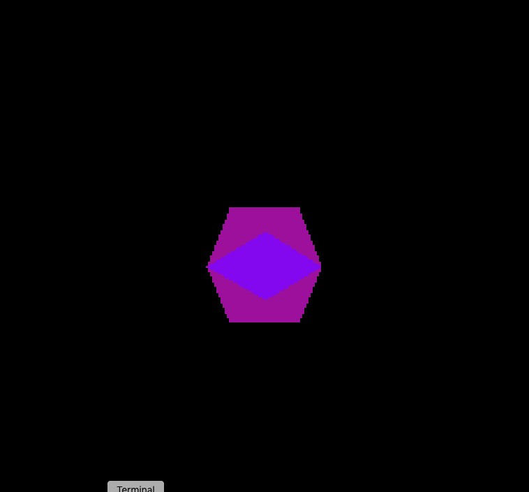

# nes3d

Displays 3D model on a Nintendo Entertainment System (NES)

### Software renderer

For precise pixel control, a purpose built software renderer purely
python is included.

### Layout

Once a full color 3D at target resolution has been rendered, it's

* Resampled to 2-bit color
* Tiled into 8x16 blocks

Tiles are then searched for duplicates, as well as mirror duplicates as the NES hardware can mirror tiles on the fly.

Each memory bank only fits 2k of data, or 128 tiles and a full frame
need 8x8 = 64 tiles. Tiles are arranged to fix the maximum number of
tiles belonging to a single frame per bank. Also outputted is a look
up table, used to find for each frame

* What bank to use
* List of the 64 tiles to show
* ...and which of those to flip horizontally and/or vertically

### Assembler program
The assembler program animates the frames, and for each frame loads
the lookup table and arranges the tiles accordingly.

## Milestones

_Screen capture of rotating icosahedron_

_Screenshot of actual nes3d program running in emulator_

_Output of software 3d renderer_

## Author
Samuel Carlsson
