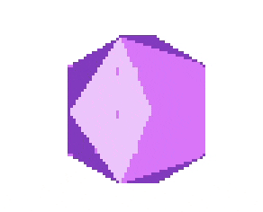

# nes3d

Displays 3D model on a Nintendo Entertainment System (NES)

## Software renderer
For precise pixel control, a purpose built software renderer purely
in python is included.

## Layout
Once all full color 3D frames at target resolution has been
rendered, it's

1. Tiled into 8x16 tiles
2. Similar tiles are found
3. Similar tiles are merged
4. Tiles are adjusted for optimal fit to desired frames

Finally, the color space is stretched to utlize the four bits to
the maximum extent, and then lastly downsampled to four bits. When
the bitmap data has been computed, it's saved into two chr files
understood by the assembler - One for the low bank and one for the
high bank.

### Assembler program
The assembler program animates the frames, and for each frame loads
the lookup table and arranges the tiles accordingly.

## Milestones
Video of nes3d running on actual [NES Hardware](milestones/hardware.mp4)

_Screen capture of rotating icosahedron_

_Output of software 3d renderer_

## Author
Samuel Carlsson
